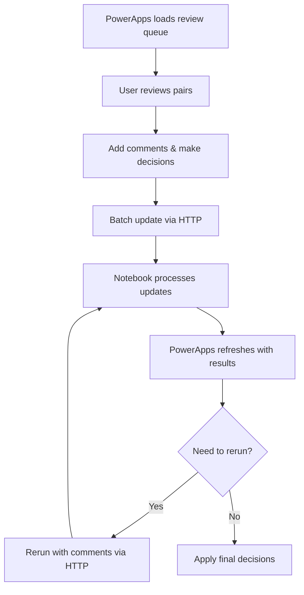

# PowerApps HTTP Integration Guide - Complete Streamlit Action Mapping
# ========================================================================

This guide shows how to perform ALL Streamlit deduplication actions through HTTP API calls for PowerApps integration.

## 🎯 Complete Action Mapping: Streamlit → PowerApps HTTP

### **Core Actions Available:**

| Streamlit Action | PowerApps HTTP Method | Description |
|-----------------|----------------------|-------------|
| Accept/Deny pairs | `UPDATE_DECISIONS` | Update pair decisions with reviewer notes |
| Add comments & rerun | `RERUN_ONLY` | Rerun LLM with context/comments |
| Rerun all LLM decisions | `RERUN_ONLY` with scope=all | Target ALL LLM decisions (not just queued) |
| Rerun specific focals | `RERUN_ONLY` with scope=focal | Target specific focal accounts |
| Rerun connected component | `RERUN_ONLY` with scope=component | Target connected account groups |
| Group management | `GROUP_OPERATIONS` | Remove/reparent/breakup/add to groups |
| Configure columns | Environment variables | Set unlimited metadata/similarity columns |

---

## 📊 **1. Reading Current State (PowerApps → Lakehouse)**

### **Get Review Queue (Items needing human review)**
```http
GET /fabric/v1/workspaces/{workspaceId}/lakehouses/{lakehouseId}/tables/review_queue.silver/rows
Authorization: Bearer {token}
```

**Example Response:**
```json
[
  {
    "pair_key": "acc1|acc3",
    "focal_master_id": "acc1",
    "candidate_master_id": "acc3", 
    "focal_account_name": "Acme Corp",
    "candidate_account_name": "ACME Corporation",
    "score": 0.85,
    "llm_decision": "NEEDS_CONFIRMATION",
    "llm_confidence": 0.72,
    "llm_reason": "Similar names but need confirmation on legal entity",
    "status": "QUEUED",
    "notes": null,
    "industry": "Technology", // metadata columns included
    "location": "New York"    // unlimited columns supported
  }
]
```

### **Filter by Status/Focal**
```http
GET .../review_queue.silver/rows?$filter=status eq 'QUEUED'
GET .../review_queue.silver/rows?$filter=focal_master_id eq 'acc1'
```

### **Get All LLM Results (for rerun targeting)**
```http
GET .../llm_results.silver/rows?$filter=run_id eq 'current_run'
```

### **Get Group Information**
```http
GET .../accounts_full_match_filter.silver/rows?$filter=is_master eq true
```

---

## ✅ **2. Accept/Deny Decisions (Streamlit → PowerApps)**

### **Streamlit Action:**
```python
# User clicks "Accept" or "Deny" on pair with comments
handle_human_decision(pair_key="acc1|acc3", decision="YES", notes="Same company confirmed")
```

### **PowerApps HTTP Equivalent:**
```http
POST /fabric/v1/workspaces/{workspaceId}/notebooks/code_1/jobs
Content-Type: application/json
Authorization: Bearer {token}

{
  "parameters": {
    "RUN_ID": "powerapp_decision_update_{timestamp}",
    "OPERATION": "UPDATE_DECISIONS",
    "DECISION_UPDATES_JSON": "[{\"pair_key\":\"acc1|acc3\",\"decision\":\"YES\",\"reviewer\":\"user@company.com\",\"notes\":\"Same company confirmed after manual review\"}]"
  }
}
```

### **Batch Decisions (Multiple pairs at once):**
```http
POST /fabric/v1/workspaces/{workspaceId}/notebooks/code_1/jobs
{
  "parameters": {
    "OPERATION": "UPDATE_DECISIONS", 
    "DECISION_UPDATES_JSON": "[
      {\"pair_key\":\"acc1|acc3\",\"decision\":\"YES\",\"reviewer\":\"user@company.com\",\"notes\":\"Confirmed same entity\"},
      {\"pair_key\":\"acc2|acc4\",\"decision\":\"NO\",\"reviewer\":\"user@company.com\",\"notes\":\"Different legal entities\"},
      {\"pair_key\":\"acc5|acc6\",\"decision\":\"YES\",\"reviewer\":\"user@company.com\",\"notes\":\"Subsidiary relationship confirmed\"}
    ]"
  }
}
```

---

## 🔄 **3. Rerun LLM with Comments (Streamlit → PowerApps)**

### **Streamlit Action:**
```python
# Add comments and rerun specific focal
rerun_llm_with_decision_comments(scope="focal", focal_ids=["acc1"])
```

### **PowerApps HTTP Equivalent:**

#### **3a. Rerun Specific Focal with Comments**
```http
POST /fabric/v1/workspaces/{workspaceId}/notebooks/code_1/jobs
{
  "parameters": {
    "RUN_ID": "powerapp_rerun_focal_{timestamp}",
    "OPERATION": "RERUN_ONLY",
    "RERUN_SCOPE": "focal",
    "RERUN_FOCALS": "acc1,acc5",
    "GLOBAL_NOTES": "Check recent merger activity and subsidiary relationships",
    "FOCAL_NOTES_JSON": "{\"acc1\":\"Focus on legal entity structure\",\"acc5\":\"Check international presence\"}",
    "SIMILARITY_COLUMNS": "[\"account_name\",\"industry\",\"location\"]",
    "LLM_CONTEXT_COLUMNS": "[\"account_name\",\"industry\",\"location\",\"revenue\"]"
  }
}
```

#### **3b. Rerun ALL LLM Decisions (Enhanced - targets ALL, not just NEEDS_CONFIRMATION)**
```http
POST /fabric/v1/workspaces/{workspaceId}/notebooks/code_1/jobs
{
  "parameters": {
    "OPERATION": "RERUN_ONLY",
    "RERUN_SCOPE": "all",
    "RERUN_ALL_LLM_QUEUED": "true",
    "GLOBAL_NOTES": "Rerun all decisions with updated industry context",
    "SIMILARITY_COLUMNS": "[\"account_name\",\"industry\",\"location\",\"legal_name\"]",
    "LLM_CONTEXT_COLUMNS": "[\"account_name\",\"industry\",\"location\",\"legal_name\",\"revenue\",\"employees\"]"
  }
}
```

#### **3c. Rerun Connected Component (Related accounts)**
```http
POST /fabric/v1/workspaces/{workspaceId}/notebooks/code_1/jobs
{
  "parameters": {
    "OPERATION": "RERUN_ONLY",
    "RERUN_SCOPE": "component", 
    "RERUN_FOCALS": "acc1,acc3",  // Seed accounts for component detection
    "GLOBAL_NOTES": "Rerun all connected accounts in this business network",
    "RERUN_NOTES_JSON": "{\"acc1|acc3\":\"Check parent-subsidiary relationship\",\"acc1|acc7\":\"Verify merger status\"}"
  }
}
```

#### **3d. Rerun Specific Pairs Only**
```http
POST /fabric/v1/workspaces/{workspaceId}/notebooks/code_1/jobs
{
  "parameters": {
    "OPERATION": "RERUN_ONLY",
    "RERUN_PAIR_KEYS": "acc1|acc3,acc2|acc4,acc5|acc6",
    "RERUN_NOTES_JSON": "{\"acc1|acc3\":\"Check recent news about merger\",\"acc2|acc4\":\"Verify different legal entities\"}",
    "GLOBAL_NOTES": "Focus on recent M&A activity"
  }
}
```

---

## 🏢 **4. Group Management Operations (Streamlit → PowerApps)**

### **Streamlit Actions:**
```python
# Remove member from group
remove_member_from_group("acc3", "acc1")

# Move member to different group  
reparent_member_to_group("acc3", "acc1", "acc7")

# Add singleton to existing group
add_parent_to_singleton("acc9", "acc1")

# Break up entire group
breakup_entire_group("acc1")
```

### **PowerApps HTTP Equivalent:**
```http
POST /fabric/v1/workspaces/{workspaceId}/notebooks/code_2/jobs
{
  "parameters": {
    "OPERATION": "GROUP_OPERATIONS",
    "GROUP_OPERATIONS_JSON": "[
      {
        \"operation\": \"remove_member\",
        \"member_id\": \"acc3\",
        \"reviewer\": \"user@company.com\",
        \"notes\": \"Account should be standalone entity\"
      },
      {
        \"operation\": \"reparent_member\",
        \"member_id\": \"acc4\", 
        \"new_master\": \"acc7\",
        \"reviewer\": \"user@company.com\",
        \"notes\": \"Move to correct parent company\"
      },
      {
        \"operation\": \"add_parent_to_singleton\",
        \"singleton_id\": \"acc9\",
        \"parent_master\": \"acc1\",
        \"reviewer\": \"user@company.com\",
        \"notes\": \"Confirmed subsidiary relationship\"
      },
      {
        \"operation\": \"breakup_group\",
        \"master_id\": \"acc5\",
        \"reviewer\": \"user@company.com\",
        \"notes\": \"Group incorrectly merged - breaking up\"
      }
    ]"
  }
}
```

---

## ⚙️ **5. Dynamic Column Configuration (Unlimited Columns)**

### **Streamlit Configuration:**
```python
# Configure similarity and context columns in UI
similarity_columns = ["account_name", "industry", "location", "legal_name"]
llm_context_columns = ["account_name", "industry", "location", "revenue", "employees"]
```

### **PowerApps HTTP Configuration:**
```http
POST /fabric/v1/workspaces/{workspaceId}/notebooks/code_1/jobs
{
  "parameters": {
    "OPERATION": "FULL_PIPELINE",  // or RERUN_ONLY
    "SIMILARITY_COLUMNS": "[\"account_name\",\"industry\",\"location\",\"legal_name\",\"address\"]",
    "LLM_CONTEXT_COLUMNS": "[\"account_name\",\"industry\",\"location\",\"legal_name\",\"revenue\",\"employees\",\"description\"]",
    "METADATA_COLUMNS": "[\"industry\",\"location\",\"revenue\",\"employees\",\"founded_year\",\"website\",\"description\"]",
    "SIMILARITY_WEIGHTS": "{\"account_name\":2.0,\"legal_name\":2.0,\"industry\":1.0,\"location\":0.5}"
  }
}
```

---

## 📱 **PowerApps Integration Examples**

### **PowerApps Screen Logic Examples:**

#### **1. Decision Making Screen**
```javascript
// PowerApps Gallery showing review queue
Items: Filter(colReviewQueue, status = "QUEUED")

// Approve Button OnSelect
Patch(colReviewQueue, ThisItem, {
    status: "APPROVED", 
    decision: "YES",
    reviewer: User().Email,
    notes: txtNotes.Text,
    pending_update: true
});

// Batch Update Flow (Power Automate)
Set(varPendingUpdates, 
    ForAll(
        Filter(colReviewQueue, pending_update = true),
        {
            pair_key: pair_key,
            decision: decision,
            reviewer: reviewer, 
            notes: notes
        }
    )
);

Power_Automate.UpdateDecisions(JSON(varPendingUpdates));
```

#### **2. Rerun with Comments Screen**
```javascript
// Global Notes Input
txtGlobalNotes.Text

// Focal-Specific Notes
ForAll(
    galSelectedFocals.AllItems,
    {
        focal_id: focal_master_id,
        notes: ThisItem.txtFocalNotes.Text
    }
)

// Rerun Button OnSelect
Power_Automate.RerunLLMWithComments(
    txtGlobalNotes.Text,
    JSON(colFocalNotes),
    ddRerunScope.Selected.Value  // "all", "focal", "component"
);
```

#### **3. Group Management Screen**
```javascript
// Remove Member Button
Power_Automate.GroupOperation({
    operation: "remove_member",
    member_id: galGroupMembers.Selected.account_id,
    reviewer: User().Email,
    notes: txtRemovalReason.Text
});

// Reparent Member Dropdown
Power_Automate.GroupOperation({
    operation: "reparent_member", 
    member_id: galMembers.Selected.account_id,
    new_master: ddNewParent.Selected.master_id,
    reviewer: User().Email,
    notes: txtReparentReason.Text
});
```

### **4. Column Configuration Screen**
```javascript
// Dynamic Column Builder
Set(varSimilarityColumns, 
    Concat(
        Filter(colAvailableColumns, similarity_enabled = true),
        "\"" & column_name & "\"",
        ","
    )
);

Set(varContextColumns,
    Concat(
        Filter(colAvailableColumns, context_enabled = true), 
        "\"" & column_name & "\"",
        ","
    )
);

// Apply Configuration
Power_Automate.UpdateConfiguration(
    "[" & varSimilarityColumns & "]",
    "[" & varContextColumns & "]"
);
```

---

## 🔄 **Real-Time Workflow Examples**

### **Complete Review Workflow:**


### **Smart Rerun Strategy:**
1. **Focused Rerun**: Target specific problematic focals
2. **Component Rerun**: Target connected business networks  
3. **Global Rerun**: Rerun all with updated context
4. **Iterative Refinement**: Add comments and rerun until satisfied

### **Group Management Workflow:**
1. **Identify Issues**: Review grouped results
2. **Plan Operations**: Decide which groups need adjustment
3. **Execute Changes**: Remove/reparent/breakup as needed
4. **Verify Results**: Check final groupings make sense

---

## 🚀 **Key Advantages of This Approach**

### ✅ **Complete Feature Parity**
- **ALL** Streamlit actions available via HTTP
- **Enhanced rerun** targeting ALL LLM decisions (not just NEEDS_CONFIRMATION)
- **Unlimited columns** support (no 2/4 column restrictions)
- **Full group management** (remove/reparent/breakup/add)

### ✅ **PowerApps Optimized** 
- **Batch operations** for efficiency
- **Real-time updates** via direct lakehouse access
- **Configurable workflows** via JSON parameters
- **Audit trail** of all operations

### ✅ **Enterprise Ready**
- **Scalable architecture** (handles any data volume)
- **Secure integration** (Azure AD authentication)
- **Comprehensive logging** (all operations tracked)
- **Flexible configuration** (unlimited metadata columns)

This gives you **complete control** over the deduplication process through PowerApps while maintaining all the sophisticated functionality of the Streamlit interface!